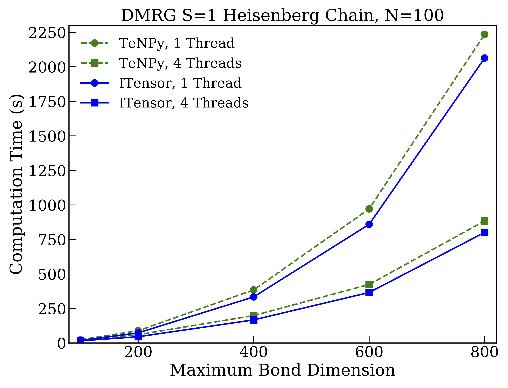
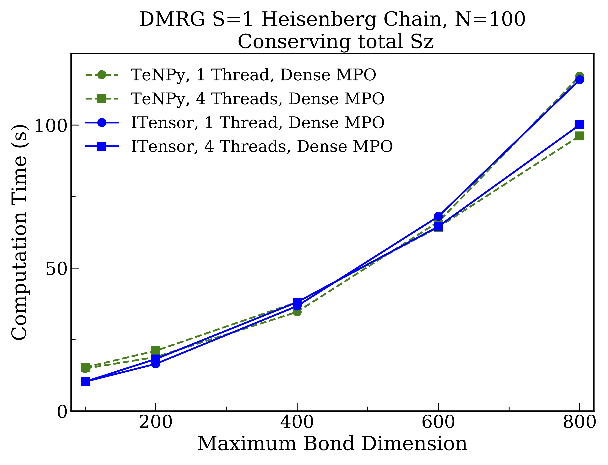
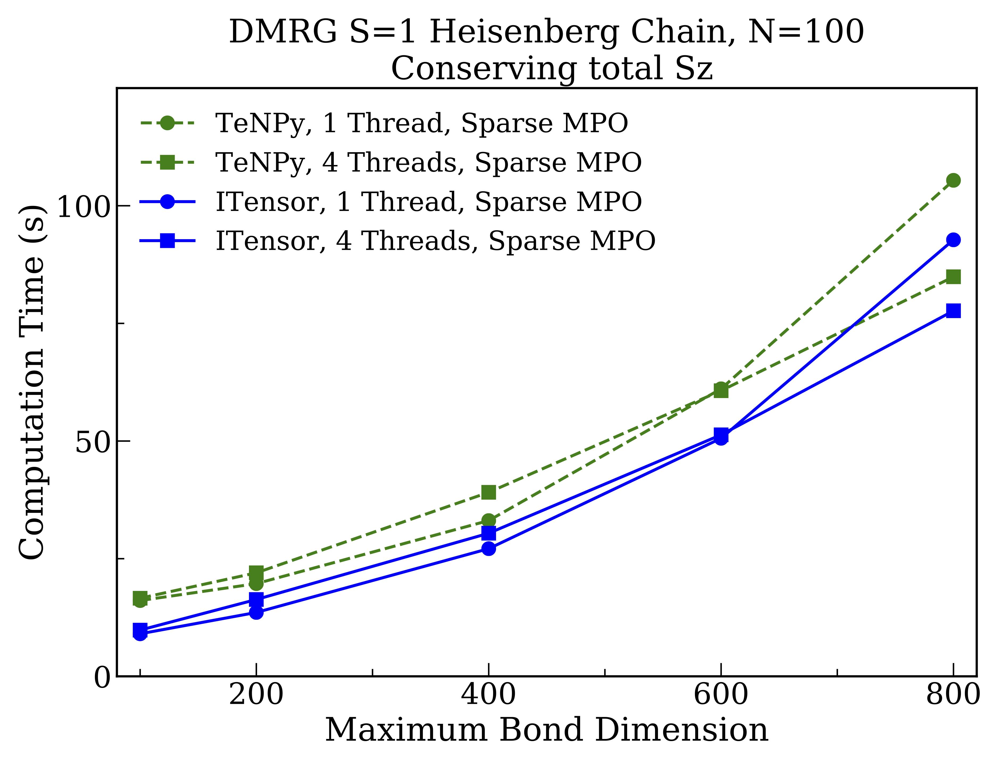

# TeNPy and ITensor Comparisons

To properly put the performance of ITensor into context, it is important to compare
to state-of-the-art tensor network software, implementing methods such as the
density matrix renormalization group (DMRG). One leading software package
for tensor networks is TeNPy, which offers a rich Python interface as well as components
implemented in C/C++ for maximum performance.[^TeNPy] The code for TeNPy is available
at [https://github.com/tenpy/tenpy](https://github.com/tenpy/tenpy). We thank TeNPY developer Johannes Hauschild for devoting significant time in helping us prepare these comparisons. 

[^TeNPy]: ["Efficient numerical simulations with Tensor Networks: Tensor Network Python (TeNPy)"](https://scipost.org/10.21468/SciPostPhysLectNotes.5), Johannes Hauschild, Frank Pollmann, _SciPost Phys. Lect. Notes_ **5** (2018) [10.21468/SciPostPhysLectNotes.5](https://scipost.org/10.21468/SciPostPhysLectNotes.5) 

Here we will be interested in comparing the performance of the Julia version of ITensor[^ITensor]
to TeNPy.

[^ITensor]: ["The ITensor Software Library for Tensor Network Calculations"](https://arxiv.org/abs/2007.14822), Matthew Fishman, Steven R. White, E. Miles Stoudenmire, arxiv:2007.14822. [https://itensor.org/](https://itensor.org)

## Setup of the Two Codes and Baseline Comparisons

To make the comparisons meaningful, we first checked that the BLAS GEMM matrix-matrix multiplication performance was the same in both our Julia and Python configurations. For this purpose we used a custom Python configuration which uses the Intel MKL implementations of BLAS and LAPACK. Other important checks included stepping through details of the DMRG codes used in both libraries, to check for example that the number of Lanczos steps performed at the core of each DMRG implementation was the same, and that similar truncation parameters resulted in similar MPS bond dimensi

All benchmarks were carried out on a single workstation with four Intel Xeon Gold 6128 (Skylake) 3.4 GHz CPUs with six cores each. Times shown are "wall" or actual time, not CPU time.
The BLAS and LAPACK distribution used for the C++, Julia, and Python calculations was Intel MKL.
For the Julia ITensor benchmarks we used version 0.2.0 of ITensors.jl running on Julia version 1.6.1.
For the TeNPy benchmark results we used TeNPy version 0.8.4.
The benchmarks presented below have been made publicly available at:
[https://github.com/ITensor/ITensorsBenchmarks.jl](https://github.com/ITensor/ITensorsBenchmarks.jl).

## Dense DMRG Comparison

First we show results for DMRG calculations not conserving any quantum numbers so that all tensors are dense. The system used was the one-dimensional Heisenberg model of one hundred $S=1$ spins:

From the results we see that both codes give identical scaling behavior with the bond dimension used, though overall the ITensor is faster by about $10\%$ for the larger bond dimensions. The relative speedup of ITensor over TeNPy for this case goes down with increasing bond dimension---as expected since eventually the calculations become dominated by BLAS operations---indicating that the performance gap is due only to operations with sub-leading scaling behavior. It is notable for this case that using BLAS multithreading gives a significant speedup.

## QN Block Sparse DMRG Comparison

Next we benchmark DMRG calculations for the same system but now conserving the total $S^z$ spin quantum number, resulting in block-sparse tensors. For this case TeNPy takes advantage by default of a sparse representation of the MPO tensor network used to represent the Hamiltonian. This sparse MPO turns out to be quite advantageous, but is currently not the default MPO format used by ITensor. So when making the comparisons we compare calculation times with both codes either making (1) the MPO as dense as possible (while still conserving total $S^z$) and (2) the MPO as sparse as possible. 

First when making the MPO as dense as possible, we find the following calculation times:

Here the performance of both libraries is remarkably similar, which reassuringly implies that neither library is incurring major inefficiencies. TeNPy performs slightly better in this case for the case of a multithreaded BLAS. But compared to the fully dense tensor case, we see that BLAS multithreading is less effective for the reasons discussed in the previous section.

## QN Block Sparse DMRG, With Sparse MPO, Comparison

Finally, we benchmark block-sparse DMRG calculations with the Hamiltonian MPO taken to be as sparse as possible. This can be accomplished in ITensor by calling 
`H = splitblocks(linkinds, H)` on the MPO before starting the DMRG calculation, and is the **default** behavior of TeNPy. 

By comparing to the previous results, we can see that making the MPO as sparse as possible speeds up both codes significantly, with the ITensor implementation now outperforming TeNPy by about $10\%$ for the largest bond dimension studied. We believe the reason for this difference is that, based on recent optimizations we have performed that significantly improved the above results, the latest version of ITensor now has rather low overhead in managing the extra details and side computations required for block-sparse tensor operations. 
Another conclusion from the above study is that the significantly better performance obtained from a maximally sparse MPO suggests it would be good default setting for ITensor going forward.
